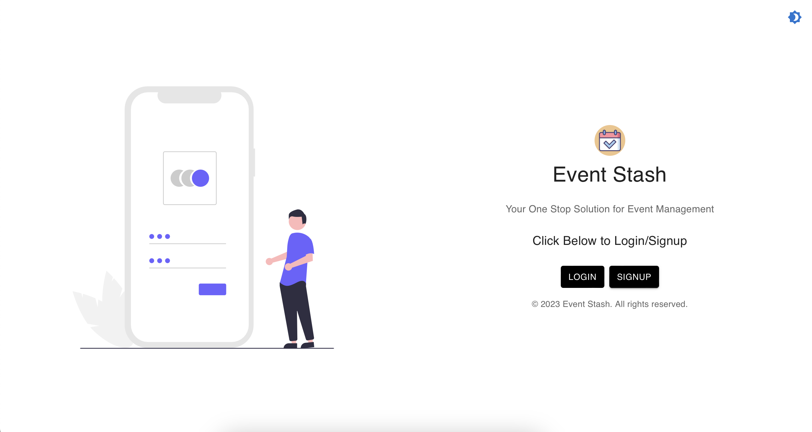

# Event Stash - An Event Management System

Event Stash is an open-source event management platform designed to streamline event creation, organization, and execution. The platform includes features such as email integration, secure user authentication, and automated attendance tracking, making it a practical and user-focused solution for event management.

## Features

- User-friendly interface for event creation, organization, and execution
- Email integration for easy communication with event participants
- Secure user authentication to ensure data privacy
- Automated attendance tracking for efficient event management

## Installation

To install Event Stash, follow these steps:

1. Clone the repository from GitHub: `git clone https://github.com/wizaye/EventStash.io.git`
2. Install the required dependencies: `npm install`
3. Start the development server: `npm start`

## Usage

To use Event Stash, simply navigate to the hosted website at [https://eventstash.netlify.app/](https://eventstash.netlify.app/) and create an account. From there, you can create, organize, and manage your events with ease.

## Screen Shots

## Contributing

If you would like to contribute to Event Stash, please follow these steps:

1. Fork the repository
2. Create a new branch: `git checkout -b my-new-feature`
3. Make your changes and commit them: `git commit -am 'Add some feature'`
4. Push to the branch: `git push origin my-new-feature`
5. Submit a pull request

## Credits

Event Stash was created by [Gatla Vijayendher](https://github.com/wizaye), [Khizar Mohamed Zubair Sait](https://github.com/khizarsait), and [Lokesh Kenche](https://github.com/LokeshKenche) as a minor project for their Bachelor of Engineering in Artificial Intelligence and Data Science at Chaitanya Bharathi Institute of Technology in Hyderabad, India.

## Documentation 
The Documentation of the project can be viewed on the [Overleaf](https://www.overleaf.com/read/wvtmjqnbbjmw#6fc52a) platform .

**Disclaimer:**

This Documentation is officially submitted in fulfilment of the minor project for the V sem of Ai&DS department for the academic year 2023-2024 while the contents of the documentation can be taken as a reference , Do not use or distribute the documentation in any means or Open-Source as its a Copyrighted Content.

## License

Event Stash is licensed under the [MIT License](https://opensource.org/licenses/MIT).

